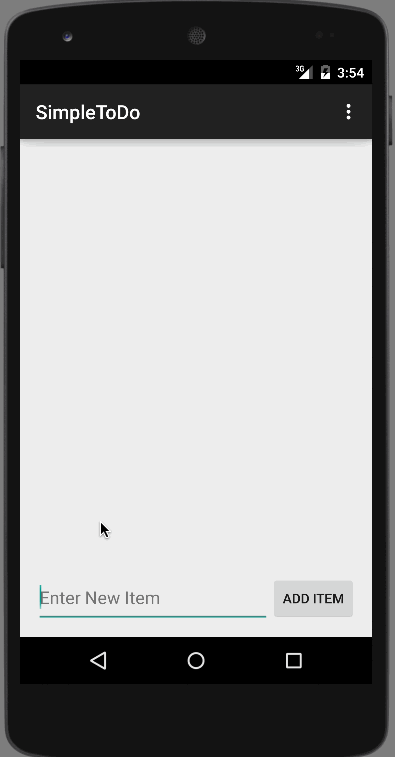

# Simple TODO List

## Overview

The app does the following:

1. Allows to add TODO Item to the list
2. Can delete an existing item by pressing and holding on the list item
3. Can Edit an item, by clicking on the item, which takes to a new screen where the item can be edited 
4. Stores the list to a file, so it is persistent and can be reloaded.

GIF Created with [LiceCap](http://www.cockos.com/licecap/).
